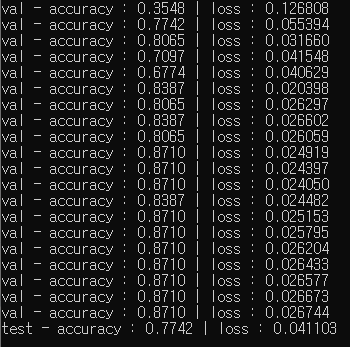

# knowledge_type_classification

knowledge type classification using GRU+Attention mechanism

## How to run

 - put ```txt_clf_data.tsv``` and ```kor2vecxxx.checkpoint.ep0``` in the same directory as ```main.py```
 - run `python main.py`

## To be implemented

 - dropout in the embedding layer
 - learning rate scheduling
 - visdualizing/showing prediction for test instances
 - ensure dataset labels are correct

 ## Initial Result

 